# Relatório de Sistematização — Laboratório Estatístico Interativo

**Aluno:** Rafael Leandro Pereira de Santana
**Matrícula:** 72650038
**Disciplina:** Matemática e Estatística para Computação
**Professor:** Romes Heriberto

Repositório: https://github.com/rafadesantana/lab-estatistica-mpe

---

## 1. Dataset e justificativa

Usei o **Brazilian E-Commerce Public Dataset by Olist**, que está disponível de graça no Kaggle, nesse link: https://www.kaggle.com/datasets/olistbr/brazilian-ecommerce. São 9 tabelas com dados reais de pedidos de uma plataforma de e-commerce brasileira, entre outubro de 2016 e agosto de 2018.

Juntei 6 dessas 9 tabelas numa tabela só (`data/varejo_brasileiro.csv`): pedidos entregues, itens do pedido, produtos, pagamentos, avaliações e clientes. No final ficaram 94.472 linhas e 18 colunas. Dessas colunas, 13 são números (valor dos produtos, frete, valor total pago, quantidade de itens, parcelas, peso, volume, número de fotos do anúncio, tamanho da descrição, dias até a entrega, dias estimados de entrega, dias de atraso e nota de avaliação) e 3 são categorias (categoria do produto, estado do cliente e tipo de pagamento). Tem também o identificador do pedido e a data da compra, que só servem pra identificar, não entram em nenhuma conta.

Escolhi esse dataset porque é dado real de comércio, e tem a ver com o meu trabalho como consultor no Sebrae, no Programa ALI. Atendo várias empresas que vendem online, então esse tipo de análise desperta meu interesse, dá pra pensar em soluções parecidas pros clientes que atendo de verdade.

## 2. Decisões de tratamento dos dados

- Só usei pedidos com status **entregue**. Um pedido cancelado não tem como calcular 'dias de atraso' de um jeito que faça sentido, então não dava pra incluir.
- Depois de juntar as tabelas, conferi e não sobrou nenhum valor vazio em nenhuma coluna. Por isso não precisei preencher nada.
- `nota_avaliacao` só pode ser um número inteiro de 1 a 5, não é uma variável contínua.
- `dias_de_atraso` pode dar negativo, quando o pedido chega antes do prazo. Isso é um problema pro ajuste da distribuição Exponencial, porque ela só existe pra valores positivos (a taxa, que é 1 dividido pela média, fica negativa e a conta para de fazer sentido). Por isso tirei essa variável só do módulo de distribuições teóricas, mas ela continua aparecendo normalmente nos outros módulos, inclusive na descoberta sobre atraso e nota.
- `id_pedido` e `data_compra` não entram em nenhuma conta, servem só pra identificar o pedido.

## 3. Núcleo estatístico: fórmulas

Todas as fórmulas abaixo estão implementadas em `core/minhastats.py`, em Python puro, sem usar nenhuma função pronta de estatística. A única biblioteca usada é a `math`, pra coisas como raiz quadrada e exponencial.

**Média**
```
média = (1/n) · Σxᵢ
```

**Variância** (populacional divide por n, amostral divide por n−1, correção de Bessel)
```
variância amostral    = Σ(xᵢ − média)² / (n − 1)
variância populacional = Σ(xᵢ − média)² / n
desvio padrão          = √variância
```

**Mediana**: dados ordenados, elemento central se n é ímpar, média dos dois centrais se n é par.

**Moda**: valor (ou valores) de maior frequência.

**Amplitude**
```
amplitude = máx − mín
```

**Percentil / quartis** (interpolação linear entre vizinhos, posição p·(n−1)/100 no vetor ordenado)
```
índice = (p/100) · (n−1)
```

**Coeficiente de variação**
```
CV = (desvio padrão / média) · 100
```

**Covariância**
```
cov(x,y) = Σ(xᵢ − médiaₓ)(yᵢ − médiaᵧ) / (n − 1)
```

**Correlação de Pearson**
```
r = cov(x,y) / (desvio_x · desvio_y)
```

**Regressão linear simples** (mínimos quadrados)
```
b₁ = cov(x,y) / variância(x)
b₀ = médiaᵧ − b₁ · médiaₓ
R² = 1 − SQres/SQtot
```

**Número de classes (regra de Sturges)**
```
k = 1 + 3,322 · log₁₀(n)
```

**Limites de outliers (regra do IQR)**
```
limite inferior = Q1 − 1,5 · IQR
limite superior = Q3 + 1,5 · IQR
```

**Densidade Normal**
```
f(x) = (1 / (σ·√(2π))) · e^(−(x−μ)²/(2σ²))
```

**Densidade Exponencial**
```
f(x) = λ · e^(−λx), para x ≥ 0
```

## 4. Tabela de validação

Cada função foi comparada com o resultado do NumPy ou do SciPy, usando o mesmo conjunto de dados de teste (`[4, 8, 15, 16, 23, 42]`, e `[2.5, 3.1, 7.4, 8.8, 9.9, 12.0]` pras funções que usam duas variáveis). A diferença entre os dois resultados precisa ser menor que **1e-9**, um número bem próximo de zero, pra passar no teste.

| Função | Referência | Diferença observada | Tolerância |
|---|---|---|---|
| `media` | `np.mean` | 0 | 1e-9 |
| `mediana` | `np.median` | 0 | 1e-9 |
| `variancia` (amostral, ddof=1) | `np.var(ddof=1)` | 0 | 1e-9 |
| `variancia` (populacional, ddof=0) | `np.var(ddof=0)` | 0 | 1e-9 |
| `desvio_padrao` | `np.std(ddof=1)` | 0 | 1e-9 |
| `percentil` | `np.percentile` | 0 | 1e-6 |
| `coeficiente_variacao` | `(std/mean)*100` | 0 | 1e-9 |
| `covariancia` | `np.cov(ddof=1)` | 7,11e-15 | 1e-9 |
| `correlacao_pearson` | `scipy.stats.pearsonr` | 2,22e-16 | 1e-9 |
| `regressao_linear_simples` (a, b) | `scipy.stats.linregress` | 0 | 1e-9 |
| `r_quadrado` | `linregress → r²` | 0 | 1e-9 |
| `limites_outliers` | Q1−1,5·IQR / Q3+1,5·IQR (cálculo manual) | 0 | 1e-9 |
| `densidade_normal` | `scipy.stats.norm.pdf` | 2,78e-17 | 1e-9 |
| `densidade_exponencial` | `scipy.stats.expon.pdf` | 0 | 1e-9 |

No total, os testes (`tests/test_minhastats.py`) somam 31, incluindo casos que deveriam dar erro de propósito (dados vazios, variância amostral com menos de 2 pontos, listas de tamanhos diferentes, uma variável que não varia) e um conjunto de dados maior, com 60 valores, pra confirmar que as funções funcionam também fora da amostra pequena de teste.

## 5. Os módulos da aplicação

### Módulo 0 — Dataset

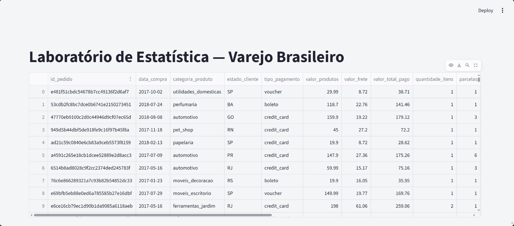

A tela inicial mostra a tabela com os 94.472 pedidos entregues, as 13 colunas numéricas e as 3 categorias, entre outubro de 2016 e agosto de 2018.

### Módulo 1 — Núcleo estatístico

É o coração do projeto, o arquivo `core/minhastats.py`, com 19 funções. Nenhuma delas usa `numpy`, `pandas` ou `statistics` pra calcular o que aparece na tela, só a biblioteca `math`, pra coisas como raiz quadrada e exponencial. `numpy` e `scipy` só entram nos testes, pra conferir se as contas batem com as prontas.

### Módulo 2 — Estatística descritiva

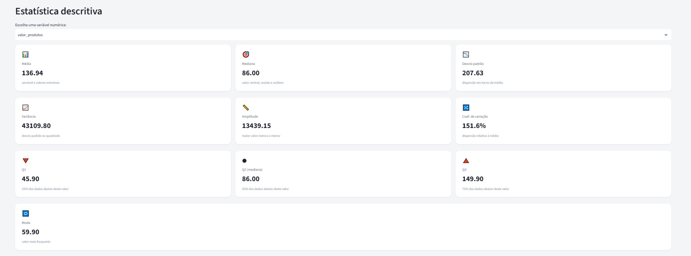

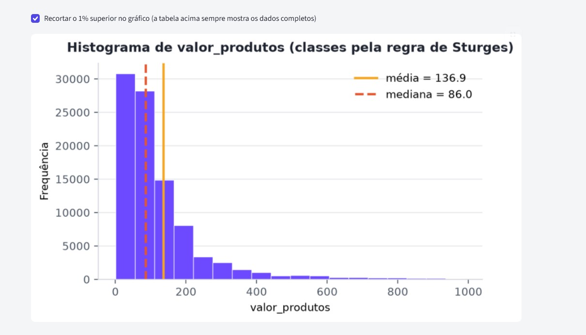

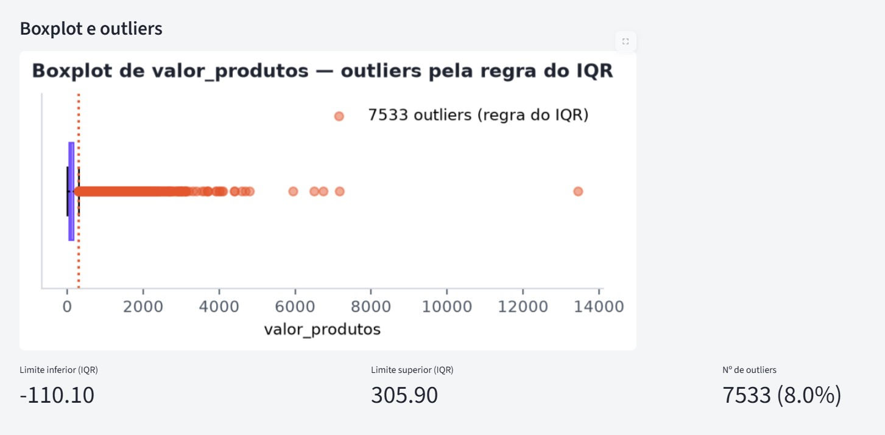

Para a estatística descritiva, é possível escolher uma variável numérica, e o app mostra a média, a mediana, o desvio padrão, a variância, a amplitude, o coeficiente de variação e os quartis. Por exemplo, olhando pra `valor_produtos`, a média dá R$ 136,94 e a mediana dá R$ 86,00. Essa diferença grande entre os dois já é um sinal de que os dados são puxados pra direita, tem uns pedidos bem caros que empurram a média pra cima, e o app comenta isso automaticamente comparando os dois números. O histograma divide os dados em 18 classes, usando a regra de Sturges, e o boxplot marca como outlier tudo que fica fora do intervalo [R$ −110,10; R$ 305,90], o que dá 7.533 pedidos, ou 8% do total. Tem também um gráfico de barras pra ver as variáveis categóricas: categoria do produto, estado do cliente e tipo de pagamento.

### Módulo 3 — Probabilidade e simulação

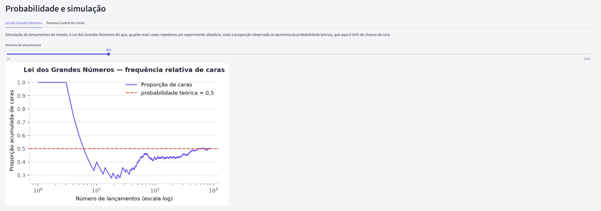

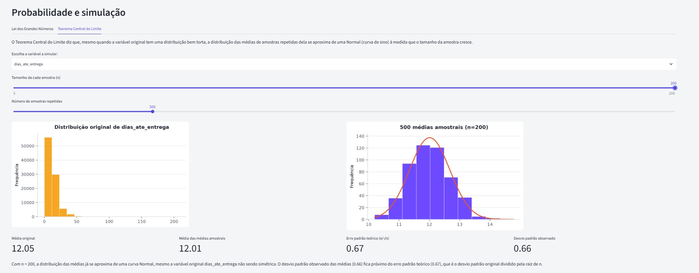

A Lei dos Grandes Números simula lançamentos de moeda, e mostra a proporção de caras se aproximando de 0,5 conforme o número de lançamentos cresce (o eixo horizontal está em escala logarítmica, pra dar pra ver desde poucos lançamentos até muitos, tudo na mesma tela). Já o Teorema Central do Limite usa uma variável de verdade do dataset, o `valor_produtos`, que é bem torta, tem muito valor baixo e poucos valores bem altos. O app sorteia várias amostras dela, com reposição, calcula a média de cada amostra, e mostra que a distribuição dessas médias vira uma curva parecida com a Normal conforme a amostra cresce, mesmo a variável original não tendo nada de Normal.

### Módulo 4 — Distribuições teóricas

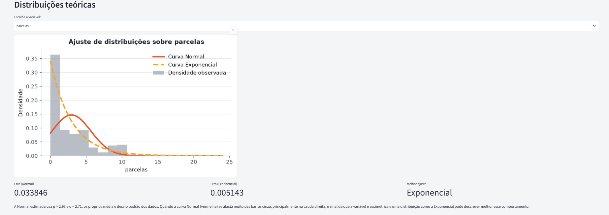

Aqui é possível ajustar duas curvas teóricas em cima do histograma real de uma variável, uma Normal (usando a própria média e desvio padrão dos dados) e uma Exponencial (usando 1 dividido pela média). Pra variáveis bem tortas, como `valor_produtos`, a curva Normal não encaixa direito na ponta direita do gráfico, e o app comenta isso automaticamente no texto. `nota_avaliacao` e `dias_de_atraso` ficaram de fora desse módulo, pelos motivos da seção 2.

### Módulo 5 — Correlação e regressão

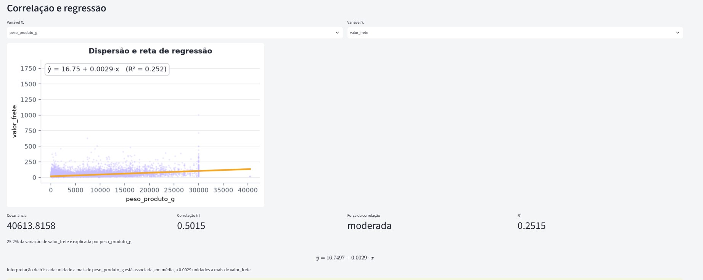

Para a correlação e regressão, é possível escolher duas variáveis, X e Y, e o app calcula a covariância, a correlação de Pearson, a reta de mínimos quadrados e o R², além de prever um valor novo digitando um X dentro do intervalo já observado nos dados. No exemplo padrão, comparando o peso do produto com o valor do frete, a correlação dá r = 0,5015, uma correlação moderada, a reta mostra um frete de R$ 16,75 + R$ 0,0029 por grama, e o R² dá 0,2515. Isso quer dizer que só o peso do produto já explica 25,2% da variação do frete, o resto vem de outros fatores, como distância e transportadora.

## 6. As 3 descobertas (Módulo 6)

### Descoberta 1 — Frete pesa mais para quem mora longe

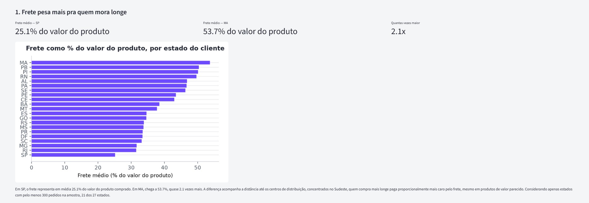

Calculei o frete como porcentagem do valor do produto, separando por estado do cliente. Em São Paulo, o frete representa em média **25,1%** do valor do produto. No Maranhão, chega a **53,7%**, quase o dobro. Olhando só pros 21 estados que tinham pelo menos 300 pedidos na amostra, pra não distorcer com estado com poucos dados, o padrão bate com a distância até os centros de distribuição, que ficam concentrados no Sudeste. Isso não prova que uma coisa causa a outra, é só uma associação que apareceu na amostra (2016 a 2018), mas faz sentido geograficamente.

### Descoberta 2 — Frete tem parte fixa e parte por peso

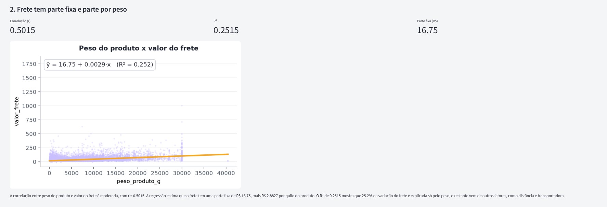

O peso do produto e o valor do frete têm uma correlação moderada (r = 0,5015). Pela regressão, o frete tem uma parte fixa de R$ 16,75, mais R$ 0,0029 por grama, o que dá R$ 2,88 por quilo. O R² deu 0,2515, ou seja, o peso sozinho explica só uma parte da variação do frete, o resto deve vir de outras coisas, tipo distância e transportadora.

### Descoberta 3 — Atraso na entrega está associado a nota mais baixa

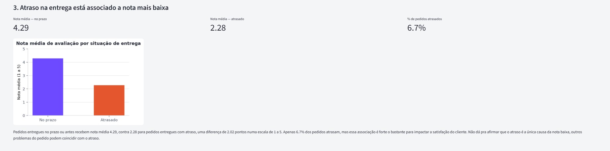

Pedidos entregues no prazo ou antes têm nota média **4,29**. Pedidos que atrasam caem pra nota média **2,28**, uma diferença de 2 pontos numa escala de 1 a 5. Só **6,7%** dos pedidos atrasam, mas o efeito na nota é forte. Não dá pra dizer que o atraso é a única causa da nota baixa, pode ter outros problemas no pedido acontecendo junto com o atraso.

